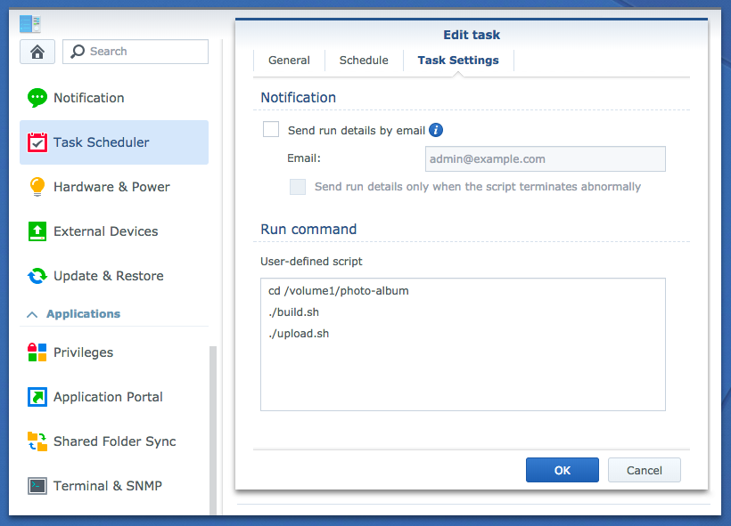

Do you love your Synology NAS but don’t want to expose it on the internet to share a few photos? Do you want to browse your galleries locally and upload them to the cloud?
A static gallery might be the answer you’re looking for.

The simplest way to run thumbsup on your NAS is using Docker. Just check if you NAS support the [Docker package](https://www.synology.com/en-global/dsm/packages/Docker).
The main aspects to be aware of are:

- it’s easier to specify all arguments inside a `config.json` file
- you must mount as many folders as required to ensure all data is accessible, including
  - the source photos (`--input`)
  - the target folder for the gallery (`--output`)
  - the config (`--config`)
  - any custom files (e.g. `--css`)
- thumbsup automatically ignores Synology-specific folders like `#recycle` and `@eaDir`

There are two main ways to run the Docker image.

### From the command line

This is the fastest way to setup thumbsup.
It's also the only way to trigger the gallery on a schedule.

You need to create a shell script inside one of the shared folders.
This can be the same shared folders as the input files or target website. Simply follow the instructions from the [Docker section](../docker), and your shell script might look something like:

```bash
#/bin/bash -e

docker run \
  -v `pwd`/photos:/input:ro \
  -v `pwd`/website:/output \
  thumbsupgallery/thumbsup:2.2.1 \
  thumbsup --config /input/thumbsup.json
```

Once the gallery has generated, you can easily upload it if required. For example you can upload the gallery to S3 using:

```bash
#/bin/bash -e

docker run \
  -v `pwd`/.aws:/root/.aws \
  -v `pwd`/website:/website:ro \
  mesosphere/aws-cli \
  s3 sync /website s3://mywebsite.com \
  --exclude '*/@eaDir/*'
```

To schedule the gallery to build weekly, open Task Scheduler in the control panel.
Add an entry to run your shell script and
make you sure the assigned user has permissions to run Docker.



> Tip: you can enable logs for all scheduled tasks at  `Settings > Enable output recording`

### From the UI

If you'd rather not touch the command line or don't need scheduling,
you can also configure Docker from the Synology Docker user interface.

When running from the UI, all paths in `config.json` must be absolute paths
and include the volume name, e.g. `/volume1/my-shared-folder/photos`.

The UI will allow you to inspect the running processes and check the logs easily.


